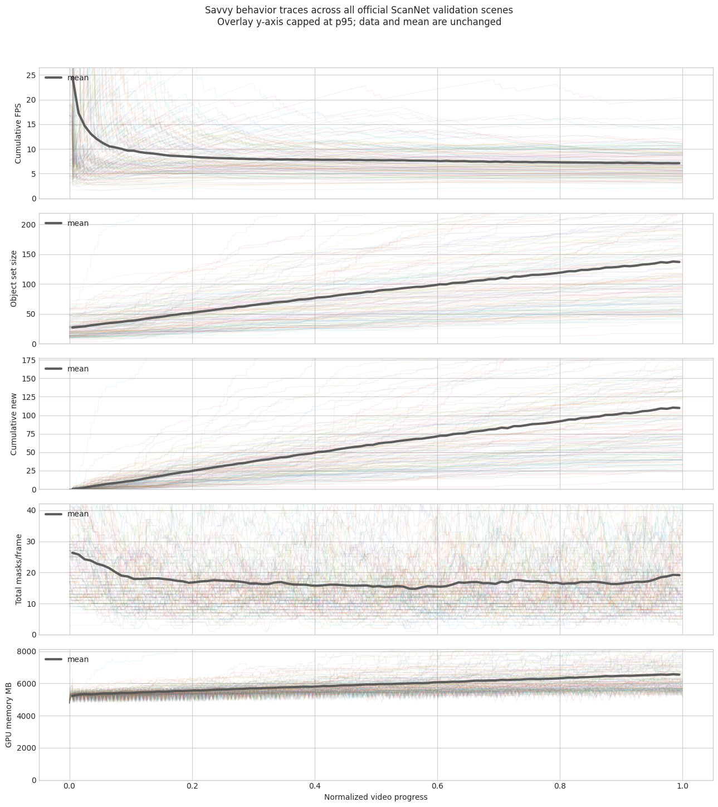
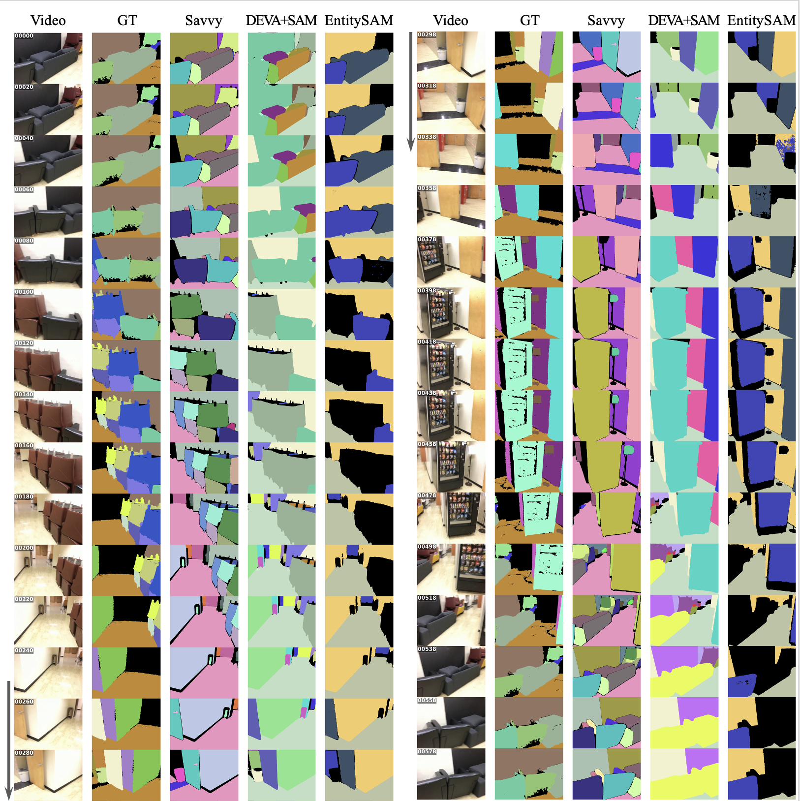
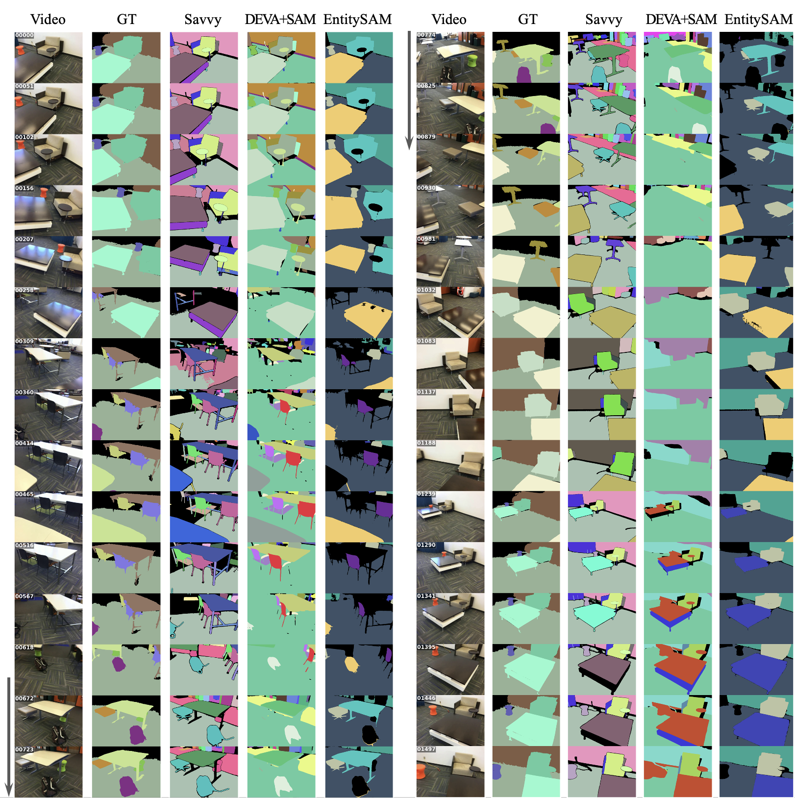
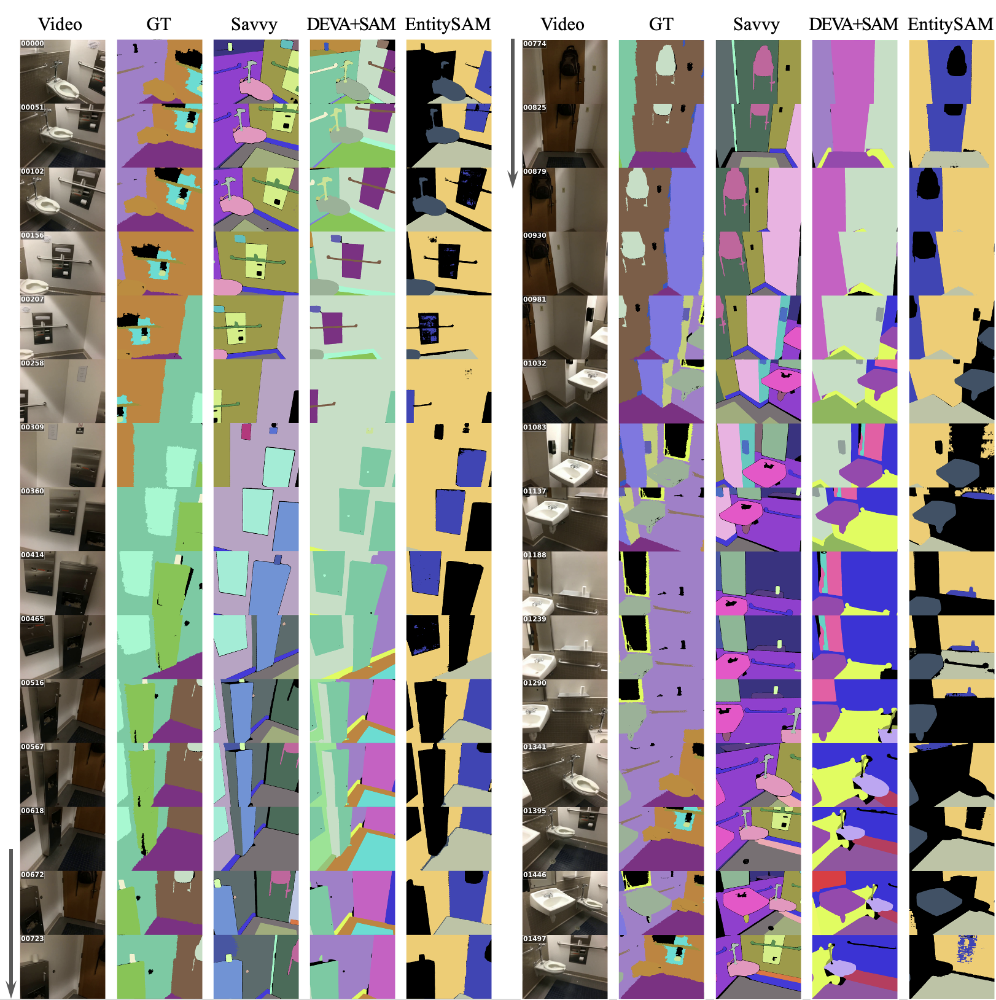
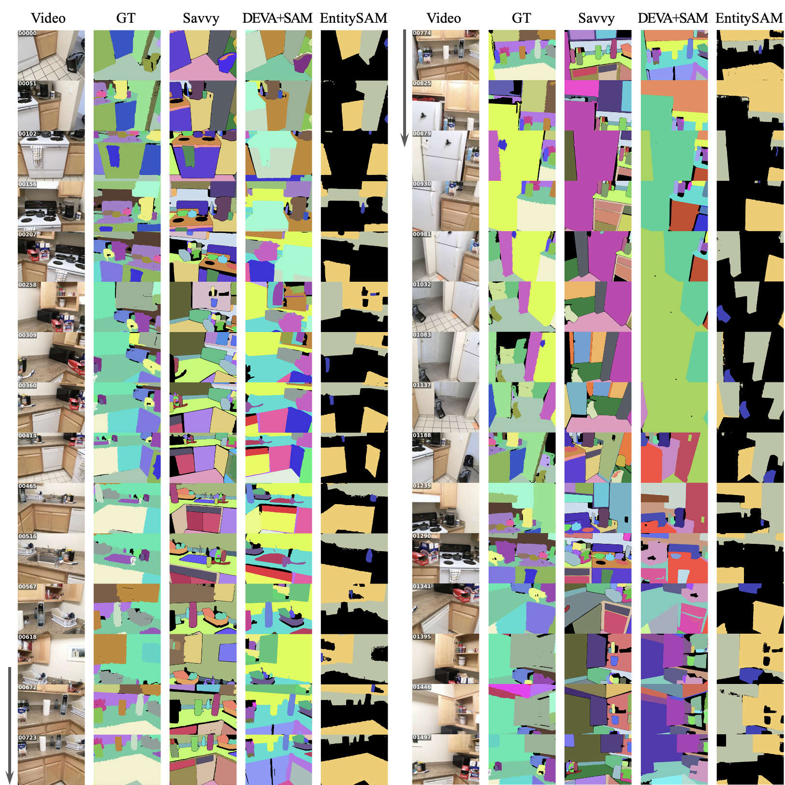
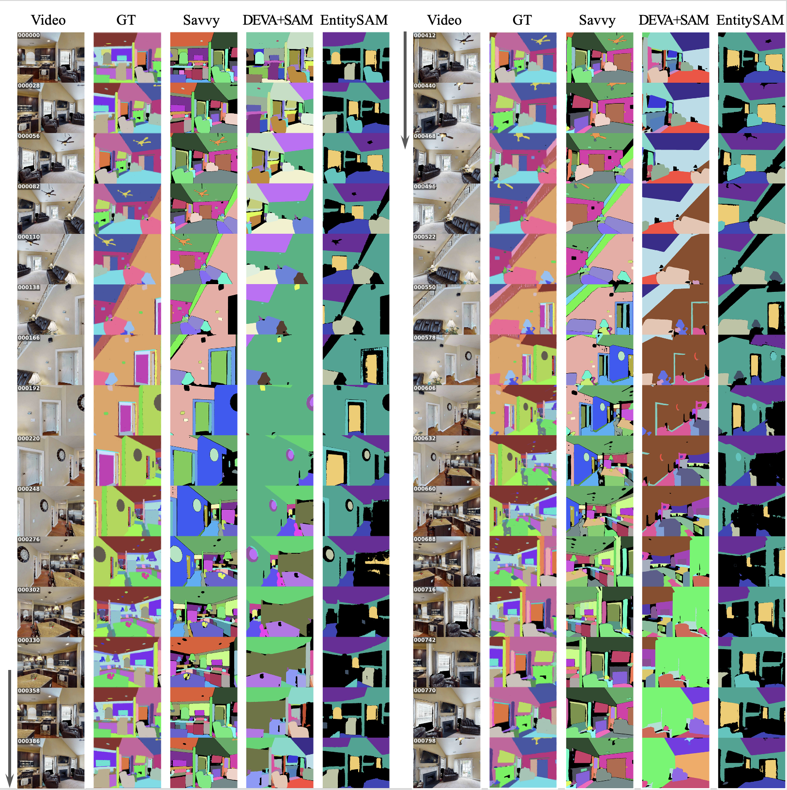
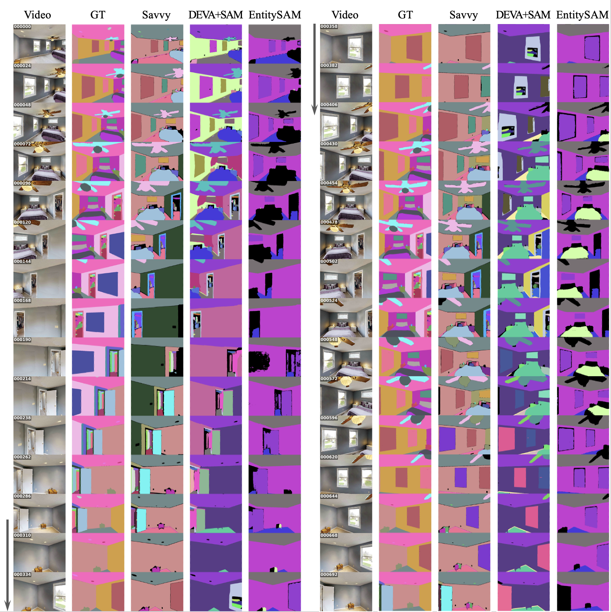
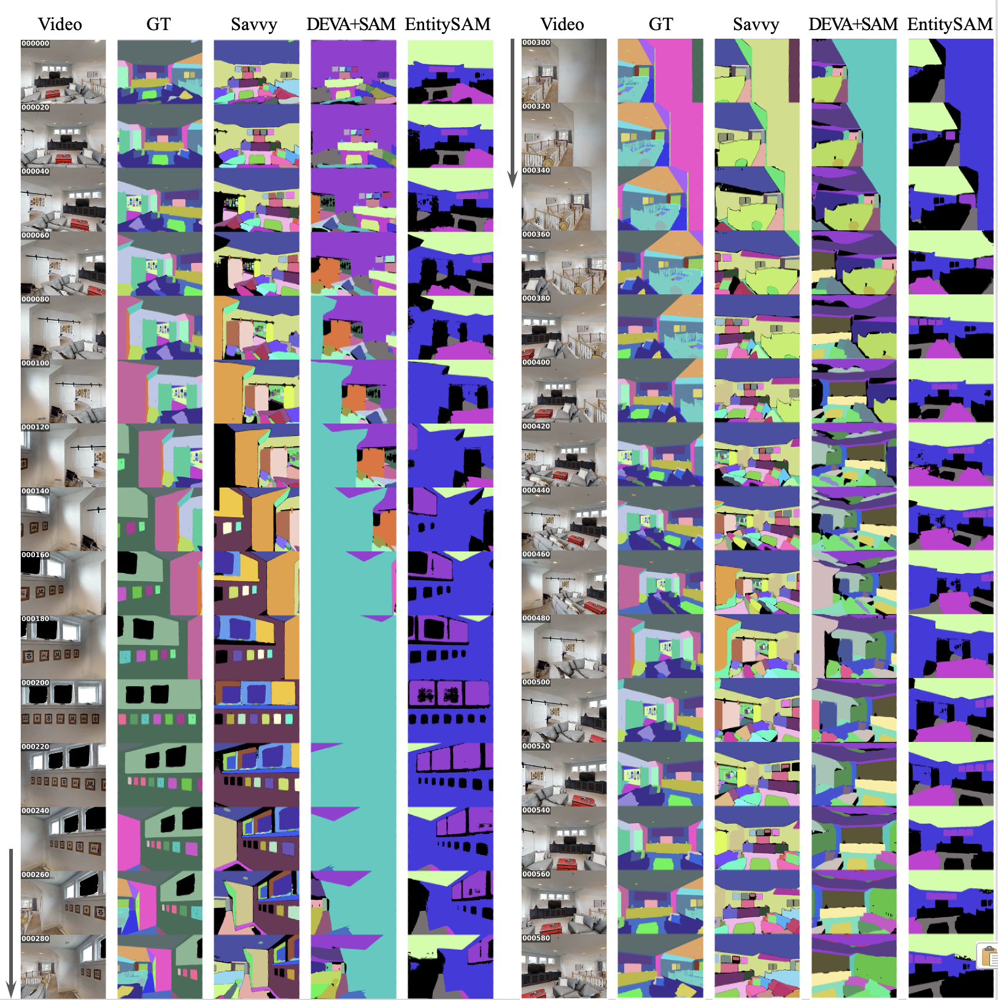

# Savvy

Savvy is an open-world video segmentation pipeline for tracking segmentation
identities across video frames. This repository also includes the accompanying
Open-world Granularity-Agnostic (OGA) evaluation code, benchmark runners, and
figure-generation utilities.

## Runtime Profiling

We provide a lightweight profiling script for the submitted Savvy inference
pipeline on the ScanNet validation split.

The script runs the default full Savvy configuration, including hierarchical
mask discovery, SAM2 propagation, deferred admission, track consolidation,
memory pruning, and active-track control.

Timing is reported as cumulative average FPS:

```text
processed frames / elapsed inference time
```

Visualization and metric computation are excluded from timing.

Example command:

```bash
python tools/profile_savvy_runtime.py \
    --device cuda:0 \
    --output runtime_logs/scannet_val/ \
    --gt_dir /path/to/scannet/gt \
    --video_dir /path/to/scannet/scannet_val \
    --sam1_ckpt /path/to/sam_vit_h_4b8939.pth \
    --sam2_ckpt /path/to/sam2.1_hiera_large.pt
```

The figure below summarizes runtime behavior over all official ScanNet
validation scenes. Thin curves show individual scenes and the dark curve shows
the mean. For readability, overlay traces are y-axis capped at the 95th
percentile; the raw data and mean curve are unchanged.



On an NVIDIA A6000, the final mean cumulative throughput is **7.4 FPS** for the
full Savvy pipeline. During inference, the mean object set grows steadily while
the number of active masks per frame remains controlled, generally **above 15**
and ending around the **high teens**. This corresponds to **more than 100
handled mask-frames per second** under the profiled setting. GPU memory remains
bounded at roughly **5-7 GB** across the validation split.

## Demo Videos

See [qualitative results](QUALITATIVE_RESULTS.md) for the full demo gallery.

Click any thumbnail to watch the demo on YouTube.

### ScanNet

| Demo | Demo | Demo | Demo | Demo |
| --- | --- | --- | --- | --- |
| [](https://youtu.be/ZF5Q4DqltdQ) | [](https://youtu.be/GbHqHBUKl3w) | [](https://youtu.be/g7WfW6JBB0o) | [](https://youtu.be/4kBFNuYYHdU) | [](https://youtu.be/7Kv2Brfmqes) |

### HM3D

| Demo | Demo | Demo | Demo | Demo |
| --- | --- | --- | --- | --- |
| [](https://youtu.be/XU4bD5u9jHY) | [](https://youtu.be/jOk4z26IqAs) | [](https://youtu.be/x90Cdeh0UcE) | [](https://youtu.be/FLKxZwibS7Y) | [](https://youtu.be/jOk4z26IqAs) |

## Qualitative Visualizations

### ScanNet



**Long-horizon qualitative results on a ScanNet sequence (1).** The sequence is
split into two vertical blocks from left to right, following the same video over
time. Early frames show couches and chairs, the camera then moves through a
corridor-like region with doors, trash bins, and a vending machine, and later
returns to the seating area. Savvy maintains a more detailed and consistent
object decomposition across these transitions: chairs, couch regions, doors,
bins, vending-machine surfaces, walls, and floor regions remain separated with
relatively stable identities as the camera viewpoint changes. DEVA+SAM often
produces broad foreground coverage, but local object structure is unstable:
chair backs and seats blob into nearby furniture, object boundaries bleed into
floors or walls, and several thin or adjacent structures are absorbed into large
regions. EntitySAM produces coarse partitions with limited new-object discovery;
large surfaces remain stable, but newly encountered objects such as chairs,
bins, door-side structures, and vending-machine details are often missed,
collapsed into background-like regions, or assigned to identities that drift
from earlier objects. This example illustrates the long-horizon OVS challenge:
good performance requires not only segmenting visible foreground, but also
expanding the object set when new objects appear, preserving fine object
boundaries, and maintaining identities when the camera leaves and later revisits
the same scene regions.



**Long-horizon qualitative results on a ScanNet sequence (2).** The sequence is
split into two vertical blocks from left to right, following the same video over
time. The camera first observes a seating/table area, then moves through a wider
room region with multiple tables and chairs, and later revisits furniture from
different viewpoints. Savvy maintains a more detailed and temporally consistent
object decomposition across the sequence: tables, chairs, sofa/couch regions,
stools, and surrounding floor/wall structures remain separated as the camera
moves and revisits previously seen areas. DEVA+SAM often provides broad
foreground coverage, but its local structure is unstable: nearby objects blob
together, chair legs and table boundaries bleed into adjacent surfaces, and thin
structures are frequently smeared or inconsistently split across frames.
EntitySAM produces coarse partitions that appear stable at the surface level,
but its new-object discovery is limited; newly encountered chairs, tables, and
small furniture pieces are often missed or absorbed into large regions, and
existing identities may drift onto visually different objects instead of
creating new object identities.



**Long-horizon qualitative results on a ScanNet sequence (3).** The sequence is
split into two vertical blocks from left to right, following the same video over
time. The camera first observes a sink, wall fixtures, counter regions, and
nearby floor/wall surfaces, then turns around towards the door region with
hanging backpack, and later revisits the bathroom fixtures from a different
viewpoint. Savvy maintains a detailed and temporally consistent object
decomposition across these large viewpoint changes: the sink basin, counter
surface, wall-mounted fixtures, door, floor, wall regions, and small objects
remain better separated and are re-associated when the camera returns.
DEVA+SAM often segments broad foreground regions, but its local structure is
unstable: sink and counter regions bleed into surrounding walls, thin fixtures
are inconsistently preserved, and large wall/floor regions absorb nearby objects
across frames. EntitySAM produces much coarser partitions with limited
new-object discovery; large surfaces remain dominant, while small fixtures, sink
details, and corridor objects are frequently missed, absorbed into
background-like regions, or assigned inconsistent identities as the viewpoint
changes.



**Long-horizon qualitative results on a cluttered ScanNet sequence (4).** The
sequence is split into two vertical blocks from left to right, following the
same video over time. The camera first observes cabinets, a stove, countertop
objects, and floor regions, then moves toward a refrigerator and doorway area,
and later returns to the kitchen workspace from different viewpoints. Savvy
maintains a detailed object decomposition in this cluttered scene: cabinets,
countertop surfaces, stove regions, bottles, small kitchen items, refrigerator
surfaces, door regions, and floor/wall structures remain more separated across
the long trajectory. DEVA+SAM captures many foreground regions but shows
frequent local bleeding and blobbing: countertop objects merge into cabinets or
counters, adjacent surfaces are inconsistently split, and small objects are
often absorbed into larger regions as the camera moves. EntitySAM produces much
coarser partitions and limited new-object discovery; large surfaces such as
cabinets, walls, and appliances dominate, while small kitchen objects and newly
observed structures are frequently missed or assigned to broad existing regions.

### HM3D



**Long-horizon qualitative results on an HM3D indoor home sequence.** The
sequence is split into two vertical blocks from left to right, following the
same video over time. The camera moves through a living-room and kitchen area
with large viewpoint changes, repeated observations of furniture, walls, doors,
ceiling structures, counters, cabinets, and small household objects. Savvy
maintains a more detailed and temporally consistent scene decomposition across
the trajectory: major room structures remain separated, while smaller objects
and furniture regions are repeatedly recovered as the viewpoint changes.
DEVA+SAM provides broad coverage but shows unstable local structure, with large
surfaces and furniture regions frequently bleeding into one another or changing
decomposition across frames. EntitySAM produces coarser partitions with limited
object-set expansion; large surfaces are often stable, but newly observed
furniture, cabinets, counters, and small objects are frequently missed as
separate identities. This example shows that the trends observed on ScanNet
also hold in HM3D: long-horizon OVS requires not only foreground coverage, but
also persistent discovery, stable granularity, and re-association across
repeated scene revisits.



**Long-horizon qualitative results on an HM3D bedroom sequence.** The sequence
is split into two vertical blocks from left to right, following the same video
over time. The camera moves around a bedroom with repeated observations of
walls, windows, doors, ceiling fan, bed, lamps, pillows, and small room objects
under large viewpoint changes. Savvy maintains a relatively detailed and
temporally consistent decomposition of both large room structures and smaller
objects: wall and ceiling regions remain separated, while the bed, fan, door,
and nearby objects are repeatedly recovered as the camera leaves and revisits
the same regions. However, window consistency remains challenging for all
methods; the same physical window can be rediscovered with a new identity or
switch identity across revisits. DEVA+SAM provides broad coverage but shows
severe local blobbing, bleeding, deformation, and unstructured fragmentation,
especially around furniture, wall/ceiling boundaries, and window regions.
EntitySAM produces coarser partitions with limited object-set expansion; large
surfaces remain dominant, while smaller objects such as the ceiling fan, lamp,
pillows, and door/window details are often missed as separate identities or
absorbed into broad regions. This example further supports the HM3D trend:
long-horizon OVS requires stable object-set maintenance across repeated views,
not only coarse foreground coverage of large indoor surfaces.



**Long-horizon qualitative results on an HM3D living-room sequence.** The
sequence is split into two vertical blocks from left to right, following the
same video over time. The camera first observes a living-room area with couches,
windows, wall decorations, tables, and shelves, then moves through a
stairway/corridor view before returning to the living-room region from different
viewpoints. Savvy maintains a relatively detailed and temporally consistent
object decomposition across these large viewpoint changes: couches, pillows,
tables, shelves, framed wall objects, windows, and room surfaces are repeatedly
recovered and kept more separated over time. DEVA+SAM provides broad coverage
but shows strong local instability, including blobbing, boundary bleeding,
deformation of furniture regions, and inconsistent fragmentation of shelves,
wall decorations, and couch/table areas. EntitySAM produces much coarser
partitions with limited object-set expansion; large surfaces and dominant
furniture regions remain visible, but many smaller objects such as frames,
pillows, shelves, and table-top items are missed as separate identities or
absorbed into broad regions. This example highlights a common HM3D challenge:
long-horizon OVS must preserve detailed object structure while the camera
alternates between wide room views, close-up wall/shelf views, and revisits to
previously observed living-room regions.

## Repository Layout

- `savvy/`: core Savvy pipeline and tracking components.
- `inference/`: generic Savvy inference for a directory of video frames.
- `evaluation/`: ScanNet, HM3D, and VIPSeg runners plus shared OGA metrics.
- `visualization/`: cleaned source modules for support matrices, behavior
  matrices, sequence strips, and identity-event curves.
- `assets/visualizations/`: README-facing figures and qualitative image assets.
- `tools/`: runtime and memory profiling utilities for ScanNet validation runs.
- `notebooks/`: lightweight example notebooks that import the cleaned modules.
- `sam2/` and `segment_anything/`: minimal adapted SAM2/SAM1 runtime subsets.
- `run_*.sh`: root-level launch scripts for common inference and evaluation jobs.

See `VENDOR_ADAPTATIONS.md` for the adapted SAM/SAM2 file list.

## Setup

This code expects a Python environment with PyTorch/CUDA support and the common
scientific Python stack used by SAM/SAM2 workflows:

- `torch`, `torchvision`
- `numpy`, `scipy`, `pandas`
- `opencv-python`
- `Pillow`
- `matplotlib`
- `hydra-core`, `omegaconf`

SAM1 and SAM2 checkpoints are required. The launch scripts expose these as
`SAM1_CKPT`, `SAM2_CKPT`, and `SAM2_CFG`; set those paths for the local environment.

## Generic Inference

Run Savvy on a directory containing an ordered sequence of frames:

```bash
./run_savvy_inference.sh /path/to/frames /path/to/output 0
```

Outputs:

- `masks/`: `uint16` PNG instance maps.
- `visualizations/`: optional overlay images.
- `metadata.json`: frame list and inference settings.

For additional options:

```bash
python -m inference.savvy_video_inference --help
```

## Benchmark Evaluation

The root scripts are the main entry points:

```bash
./run_scannet_eval.sh
./run_hm3d_eval.sh
./run_vipseg_eval.sh 0
```

Before running, edit dataset and checkpoint paths in the scripts.

The shared OGA metric implementation lives in `evaluation/oga_metrics/`.
ScanNet/HM3D evaluation outputs are written as `oga_full_results*.json/csv`.
VIPSeg evaluation outputs are written as `vipseg_savvy_oga_*`.

## Visualization

Reusable visualization code lives under `visualization/`:

- `support_matrix_behavior_matrix.py`
- `identity_discovery_reassociation_events.py`
- `sequence_strips.py`

A lightweight notebook with placeholder paths is available at:

```text
notebooks/visualization_examples.ipynb
```

The notebook demonstrates sequence strips, support matrices, OGA behavior
matrices, and reassociation-event curves.
